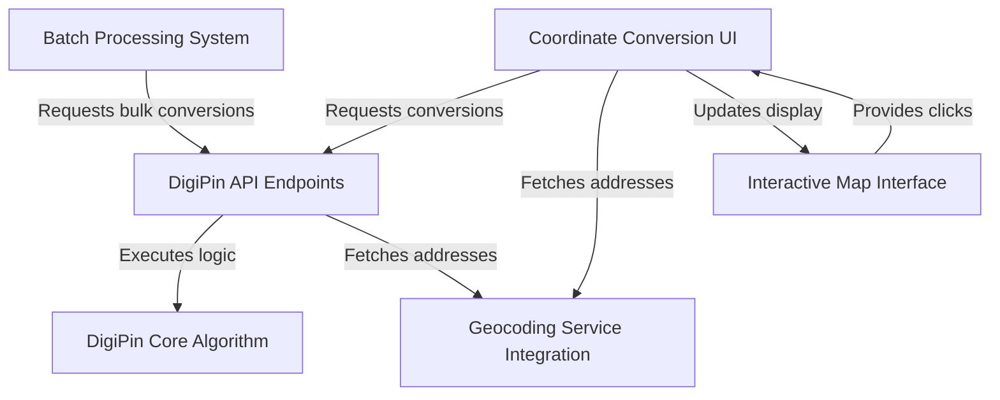
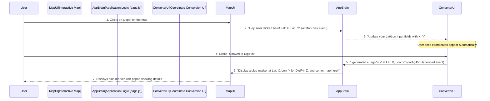
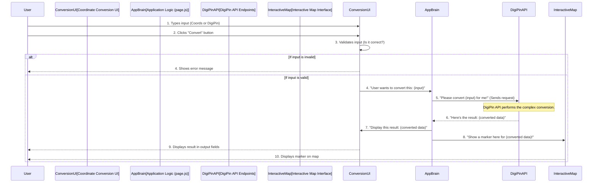
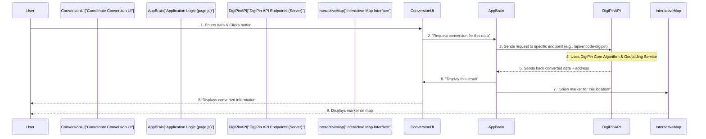
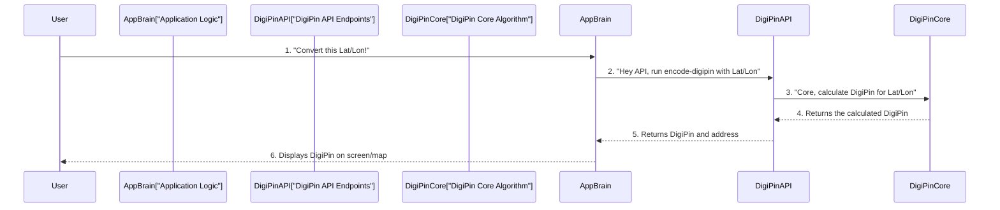
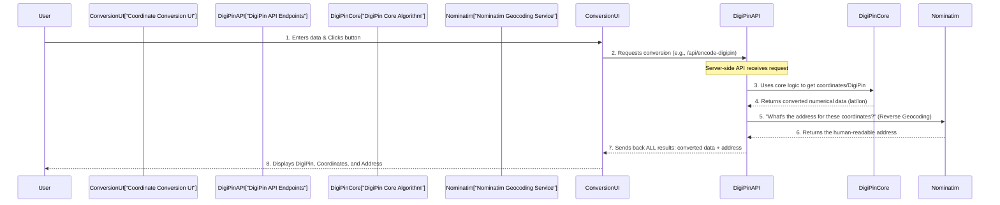
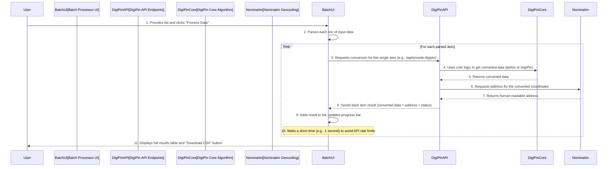

# Tutorial: Digipin

The DigiPin project is a web application that *translates* precise geographical locations into unique 10-character **DigiPins**, and can *decode* those DigiPins back into coordinates. It offers an **interactive map** for visual selection, supports both *single* and *bulk* conversions, and enhances results with **human-readable addresses** by integrating with external geocoding services.


## Visual Overview



## Chapters

1. [Interactive Map Interface
](01_interactive_map_interface_.md)
2. [Coordinate Conversion UI
](02_coordinate_conversion_ui_.md)
3. [DigiPin API Endpoints
](03_digipin_api_endpoints_.md)
4. [DigiPin Core Algorithm
](04_digipin_core_algorithm_.md)
5. [Geocoding Service Integration
](05_geocoding_service_integration_.md)
6. [Batch Processing System
](06_batch_processing_system_.md)

---

<sub><sup>Generated by [AI Codebase Knowledge Builder](https://github.com/The-Pocket/Tutorial-Codebase-Knowledge).</sup></sub>

# Chapter 1: Interactive Map Interface

Have you ever looked at a map and wished you could just point to a spot and instantly get its exact location details, or see where a special code refers to? That's exactly what the "Interactive Map Interface" in DigiPin helps you do!

### What's the Big Idea? (Why do we need a map?)

Imagine you're trying to describe a very specific place, like "the exact center of the park where we had that picnic." It's hard to explain with just words, right? You might use an address, but what if there's no address, or you need to be super precise?

This is where the Interactive Map Interface comes in handy. It's the visual heart of our DigiPin application. Think of it as your digital globe, helping you visually pinpoint locations and understand where the DigiPins refer to.

**Here's the main problem it solves:**
*   **Finding exact coordinates:** Instead of guessing or looking up numbers, you can simply click on any spot on the map to get its precise latitude and longitude.
*   **Visualizing DigiPins:** If someone gives you a DigiPin code, how do you know where that place *is*? The map shows you by placing a marker right on that spot.

Let's use a simple example: You want to find the DigiPin for your favorite coffee shop, but you only know where it is on a map, not its exact coordinates. The Interactive Map Interface allows you to click on the coffee shop's location on the map, get its coordinates automatically, and then use those coordinates to generate a DigiPin!

### Key Concepts of Our Interactive Map

The Interactive Map Interface isn't just a static picture. It has a few smart features that make it truly helpful:

1.  **The Visual Map:** This is the basic map you see on your screen. You can move it around (pan) and zoom in or out, just like using Google Maps or Apple Maps. It gives you a clear geographical background for everything you do.

2.  **Click to Select Coordinates:** This is a super neat trick! Instead of typing long numbers for latitude and longitude, you can just click anywhere on the map. The map then instantly tells the application the exact coordinates of where you clicked. This makes selecting locations quick and error-free.

3.  **Displaying Markers:** When you use DigiPin to convert information (like converting coordinates to a DigiPin code, or decoding a DigiPin code back into coordinates), the map doesn't just sit there. It places a special "pin" or "marker" on the map at the exact location it's talking about.
    *   **Blue Markers:** Show where a DigiPin was *generated* from your selected coordinates.
    *   **Green Markers:** Show where a decoded DigiPin *points to*.
    This visual feedback helps you immediately see and confirm the location.

4.  **Geographical Context:** By seeing the location on a map, you get a better sense of where it is in the real world. Is it in a city? Next to a river? In a remote area? The map provides that context instantly.

### How to Use the Map Interface

Using the map is very straightforward:

1.  **Open DigiPin:** When you open the DigiPin application, you'll see the Interactive Map on the right side of your screen.
2.  **Select a Location:** Want to find coordinates? Simply **click anywhere on the map**. You'll see the latitude and longitude automatically fill into the "Coordinate to DigiPin" input fields on the left side of your screen. This is your input for generating a DigiPin!
3.  **See Your Results:** After you've converted coordinates to a DigiPin (or vice-versa), watch the map! A colorful marker will appear, showing you exactly where that DigiPin or those coordinates are located. A small box (called a "popup") will also appear next to the marker, giving you details like the DigiPin, latitude, and longitude.

Let's see a tiny peek at how the main application screen uses the map:

```javascript
// From: src/app/page.js

export default function Home() {
  // ... other setup code ...

  const [mapCenter, setMapCenter] = useState([20.5, 78.9]); // Map starts centered on India
  const [mapZoom, setMapZoom] = useState(5); // And at a certain zoom level
  const [marker, setMarker] = useState(null); // No marker at first
  const [selectedCoords, setSelectedCoords] = useState({ lat: '', lon: '' });

  // This function runs when you click on the map
  const handleMapClick = (lat, lon) => {
    // We update the selected coordinates based on where you clicked
    setSelectedCoords({ lat: lat.toFixed(6), lon: lon.toFixed(6) });
  };

  // This function runs when a DigiPin is generated or decoded
  const handleCoordinateGenerated = (lat, lon, digiPin, address) => {
    const newMarker = {
      lat: parseFloat(lat), lon: parseFloat(lon),
      digiPin, address, type: 'digipin' // 'digipin' type for blue marker
    };
    setMarker(newMarker); // Show the marker on the map
    setMapCenter([newMarker.lat, newMarker.lon]); // Center map on the marker
    setMapZoom(12); // Zoom in on the marker
  };

  // ... similar handleDigiPinDecoded function ...

  return (
    // ... layout code ...
    <div className="h-96 lg:h-[600px]">
      <MapComponent
        center={mapCenter}
        zoom={mapZoom}
        marker={marker} // This tells the map where to put a pin
        onMapClick={handleMapClick} // This tells the map what to do when clicked
      />
    </div>
    // ... rest of the layout ...
  );
}
```
**What's happening here?**
*   When you **click the map**, the `handleMapClick` function is called. It takes the `lat` (latitude) and `lon` (longitude) of your click and saves them. This then updates the input fields for coordinate conversion.
*   When you **generate a DigiPin** or **decode one**, functions like `handleCoordinateGenerated` are called. These functions create a `marker` object (which holds the location and details) and tell the map to `setMarker`, `setMapCenter`, and `setMapZoom`. This makes the map show the pin and move to focus on it.

### What's Under the Hood? (How does it work?)

Let's quickly peek behind the curtain to understand how the map works its magic.

Imagine you're the user, and the map is a smart assistant.



Here's a breakdown of the steps:

1.  **You Click:** When you click anywhere on the Interactive Map, the map component (which uses a library called Leaflet) detects this click.
2.  **Map Tells App:** The map then tells the main application (`page.js`) exactly where you clicked (latitude and longitude). This communication happens using something called `onMapClick`.
3.  **App Updates Input:** The `page.js` then takes these coordinates and automatically fills them into the "Coordinate to DigiPin" input boxes on the left side of your screen. No typing needed!
4.  **You Convert:** You then use these pre-filled coordinates and click "Convert to DigiPin".
5.  **Converter Tells App:** Once the DigiPin is generated (or decoded), the converter component tells `page.js` the result (the DigiPin, the coordinates, and any address found).
6.  **App Updates Map:** `page.js` then updates the map component, telling it: "Hey, put a marker at *this* specific latitude and longitude, show *this* DigiPin in its popup, and zoom in on that spot!"
7.  **Map Shows Marker:** The map component draws a nice, colorful marker at the exact location, confirming your conversion visually.

### A Closer Look at the Code

The Interactive Map is built using a few key pieces. The core map logic lives in `src/components/MapWrapper.jsx`, and it's then used by `src/components/MapComponent.jsx` (which helps it load correctly in web browsers) and finally displayed on `src/app/page.js`.

Let's simplify `src/components/MapWrapper.jsx`:

```javascript
// From: src/components/MapWrapper.jsx

import { MapContainer, TileLayer, Marker, Popup, useMapEvents } from 'react-leaflet';
import L from 'leaflet'; // A library for interactive maps

// ... (code to fix default marker images) ...

// This small helper listens for clicks on the map
function MapEventHandler({ onMapClick }) {
  useMapEvents({
    click: (e) => { // When a click happens...
      const { lat, lng } = e.latlng; // Get the latitude and longitude
      onMapClick(lat, lng); // Send it up to the main application
    },
  });
  return null; // This component doesn't draw anything itself
}

const MapWrapper = ({ center, zoom, marker, onMapClick }) => {
  // ... (code for createCustomIcon - makes our markers blue/green circles) ...

  return (
    <MapContainer
      center={center} // Where the map is centered
      zoom={zoom}     // How zoomed in or out the map is
      className="w-full h-full"
    >
      <TileLayer // This is the actual map imagery (like satellite or street view)
        attribution='&copy; <a href="https://www.openstreetmap.org/copyright">OpenStreetMap</a> contributors'
        url="https://{s}.tile.openstreetmap.org/{z}/{x}/{y}.png"
      />

      <MapEventHandler onMapClick={onMapClick} /> {/* Our click listener */}

      {marker && ( // If there's a 'marker' to show...
        <Marker
          position={[marker.lat, marker.lon]} // Place it at these coordinates
          icon={createCustomIcon(marker.type)} // Use our custom blue/green icon
        >
          <Popup> {/* When you click the marker, this little box appears */}
            <div>
              <strong>DigiPin:</strong> {marker.digiPin} <br/>
              <strong>Latitude:</strong> {marker.lat} <br/>
              <strong>Longitude:</strong> {marker.lon}
            </div>
          </Popup>
        </Marker>
      )}

      {/* ... (code for map legend and click instruction text) ... */}
    </MapContainer>
  );
};

export default MapWrapper;
```

**Breaking down the `MapWrapper.jsx`:**

*   **`MapContainer`**: This is the main box that holds the entire map. You tell it where to `center` and how much to `zoom`.
*   **`TileLayer`**: This is what makes the map *look* like a map! It fetches map images (tiles) from a service like OpenStreetMap and displays them. Without this, you'd just have a blank box.
*   **`MapEventHandler`**: This is a clever little helper. It uses something called `useMapEvents` (from the `react-leaflet` library) to "listen" for when someone `click`s on the map. When a click happens, it gets the latitude (`lat`) and longitude (`lng`) and then uses the `onMapClick` function (which was given to it by `page.js`) to send these coordinates back to the main application.
*   **`Marker` and `Popup`**: When `page.js` tells `MapWrapper` that there's a `marker` to display, this part of the code springs into action.
    *   `Marker` places a pin at the `position` (latitude and longitude) you give it.
    *   `icon={createCustomIcon(marker.type)}` makes sure our pins are those cool blue or green circles, not just the default red pins.
    *   `Popup` creates the little information box that appears when you click on the marker.

This setup makes the map dynamic and responsive to your actions, whether you're clicking to select coordinates or viewing where a DigiPin points!

### Conclusion

The Interactive Map Interface is your visual command center in DigiPin. It simplifies getting coordinates by letting you click directly on a map, and it provides clear feedback by showing markers for your generated DigiPins or decoded coordinates. It's designed to make working with geographical data intuitive and visually engaging.

Now that you understand how to use the map to select coordinates, our next step is to learn how to actually *convert* those coordinates into a DigiPin, or turn a DigiPin back into coordinates. Let's move on to the [Coordinate Conversion UI](02_coordinate_conversion_ui_.md)!

---

<sub><sup>Generated by [AI Codebase Knowledge Builder](https://github.com/The-Pocket/Tutorial-Codebase-Knowledge).</sup></sub> <sub><sup>**References**: [[1]](https://github.com/Kvr-10/Digipin/blob/46da315d3734884bac31f262a43c323f70b4fddd/src/app/page.js), [[2]](https://github.com/Kvr-10/Digipin/blob/46da315d3734884bac31f262a43c323f70b4fddd/src/components/MapComponent.jsx), [[3]](https://github.com/Kvr-10/Digipin/blob/46da315d3734884bac31f262a43c323f70b4fddd/src/components/MapWrapper.jsx)</sup></sub>

# Chapter 2: Coordinate Conversion UI

In [Chapter 1: Interactive Map Interface](01_interactive_map_interface_.md), we learned how to use the map to visually find a spot and even automatically get its coordinates. That's a great start! But once you have those coordinates, or if someone gives you a special DigiPin code, how do you actually *convert* them? How do you turn `28.6139` Latitude and `77.2090` Longitude into a DigiPin, or turn `FC9-8J3-2K45` back into coordinates?

This is where the "Coordinate Conversion UI" comes in!

### What's the Big Idea? (Your Digital Translator)

Think of the Coordinate Conversion UI as the **digital translator** inside DigiPin. It's the part of the application where you directly tell DigiPin: "Here are some coordinates, give me the DigiPin!" or "Here's a DigiPin, tell me where it is!"

**The main problem it solves:**
*   **Simple, one-off conversions:** You don't need to understand complex math or coding. You just type in what you have (coordinates or a DigiPin) and click a button.
*   **Clear results:** It shows you the converted information, like the DigiPin, latitude, longitude, and even a readable address.
*   **Error handling:** If you type something wrong, it gently tells you what's incorrect.

Let's use a simple example: You just clicked on your friend's house on the map, and now you have its precise latitude and longitude. The Coordinate Conversion UI is where you'll see those numbers automatically appear, and then you'll use it to instantly generate the unique DigiPin for that spot. Or, if a friend gives you a DigiPin, this is where you'll type it in to find out *exactly* where that spot is on the map and what its address is.

### Key Concepts of Our Conversion UI

The Coordinate Conversion UI isn't just a simple box. It's built with a few smart features to make your life easier:

1.  **Input Fields:** These are the text boxes where you type your Latitude, Longitude, or DigiPin code. They're designed to be easy to use.
2.  **Conversion Buttons:** These are the "magic" buttons you click (like "Generate DigiPin" or "Find Coordinates") to start the conversion process.
3.  **Output Display:** After you click the button, this is where your results (the generated DigiPin, or the decoded coordinates and address) neatly appear.
4.  **Input Validation:** DigiPin is smart! It checks your input to make sure it's correct. For example, it checks if your latitude and longitude numbers are within a valid range, or if your DigiPin has the right length and characters. This prevents mistakes.
5.  **Error Messages:** If something isn't right (like a typo in your DigiPin), the UI will show a clear message explaining the problem so you can fix it.
6.  **Address Lookup:** After converting, DigiPin often tries to find a human-readable address for the location, using a service we'll talk about in [Chapter 5: Geocoding Service Integration](05_geocoding_service_integration_.md).
7.  **Clear & Copy Buttons:** Handy buttons to quickly clear the form or copy the generated DigiPin to your clipboard!

### How to Use the Coordinate Conversion UI

You'll find two main sections in the Coordinate Conversion UI: one for converting coordinates to DigiPin, and another for converting DigiPin to coordinates.

#### Scenario 1: Coordinates to DigiPin

Let's say you have coordinates (e.g., from clicking on the map as we learned in Chapter 1) and you want to get a DigiPin.

1.  **Open DigiPin:** When you open the application, on the left side, you'll see the "Coordinates to DigiPin" section.
2.  **Enter Coordinates:**
    *   If you **clicked on the map**, the Latitude and Longitude fields will automatically fill in! That's the smart connection with the [Interactive Map Interface](01_interactive_map_interface_.md).
    *   If you know the coordinates, you can also **type them directly** into the "Latitude" and "Longitude" fields.
    *   You can even click "Use Current Location" to let your browser find your current coordinates!
3.  **Click to Generate:** Click the blue "Generate DigiPin" button.
4.  **See the DigiPin:** The generated DigiPin will appear in a green box below the button. You'll also see a human-readable address and a handy "Copy" button! And remember, a blue marker will appear on the map to show you where this DigiPin points!

**Example Input and Output:**

*   **Input (Latitude):** `28.6139`
*   **Input (Longitude):** `77.2090`
*   **You Click:** "Generate DigiPin"
*   **Output:** A DigiPin like `FC9-8J3-2K45` appears. The map updates with a blue marker, and the address might show "New Delhi, Delhi, India".

#### Scenario 2: DigiPin to Coordinates

Now, let's say a friend gives you a DigiPin code like `FC9-8J3-2K45`, and you want to know where it is.

1.  **Open DigiPin:** On the left side, scroll down to the "DigiPin to Coordinates" section.
2.  **Enter DigiPin:** Type the DigiPin code into the "DigiPin Code" field. Don't worry about the hyphens; DigiPin will add them for you!
3.  **Click to Find:** Click the green "Find Coordinates" button.
4.  **See the Location:** The exact Latitude and Longitude will appear, along with the address. A green marker will also appear on the map, showing you the exact location of that DigiPin!

**Example Input and Output:**

*   **Input (DigiPin Code):** `FC9-8J3-2K45`
*   **You Click:** "Find Coordinates"
*   **Output:** Latitude `28.6139`, Longitude `77.2090` appears. The map updates with a green marker, and the address might show "New Delhi, Delhi, India".

### What's Under the Hood? (How Does It Work?)

Let's peek behind the curtain to see the steps when you use the Coordinate Conversion UI:



Here's a step-by-step breakdown:

1.  **You Enter and Click:** You type your information into the input fields and click the conversion button.
2.  **UI Validates:** The Conversion UI first quickly checks if your input makes sense (e.g., are the coordinates numbers? Is the DigiPin the right length?). If not, it shows you an error message right away.
3.  **UI Talks to App Brain:** If your input is good, the Conversion UI tells the main "Application Logic" (which lives in `src/app/page.js`) what you want to convert.
4.  **App Brain Talks to DigiPin API:** The `page.js` then sends your request to the "DigiPin API Endpoints" (our smart backend system, which we'll explore in [Chapter 3: DigiPin API Endpoints](03_digipin_api_endpoints_.md)). This API is where the actual mathematical conversion happens.
5.  **API Sends Back Results:** The DigiPin API does its magic and sends the converted data (like the DigiPin or the coordinates) back to `page.js`.
6.  **App Brain Updates UI and Map:** `page.js` then takes these results and tells *both* the Conversion UI (to show the numbers in the output boxes) *and* the [Interactive Map Interface](01_interactive_map_interface_.md) (to place a marker and zoom to the location) to update.
7.  **You See the Magic:** The results appear in the UI, and a marker appears on the map, confirming your conversion!

### A Closer Look at the Code

The Coordinate Conversion UI is primarily handled by two components:
*   `src/components/CoordinateToDigiPin.jsx`: For turning coordinates into DigiPins.
*   `src/components/DigiPinToCoordinate.jsx`: For turning DigiPins into coordinates.

These components are then used together in `src/app/page.js`, which is like the "command center" of our application.

Let's look at a simplified version of `CoordinateToDigiPin.jsx`:

```javascript
// From: src/components/CoordinateToDigiPin.jsx

import { useState, useEffect } from 'react';

const CoordinateToDigiPin = ({ onDigiPinGenerated, selectedCoords }) => {
  const [latitude, setLatitude] = useState(''); // Stores the latitude from input
  const [longitude, setLongitude] = useState(''); // Stores the longitude from input
  const [digiPin, setDigiPin] = useState(''); // Stores the generated DigiPin
  const [error, setError] = useState(''); // Stores any error messages

  // This runs when you click on the map!
  useEffect(() => {
    if (selectedCoords.lat && selectedCoords.lon) {
      setLatitude(selectedCoords.lat); // Update latitude from map click
      setLongitude(selectedCoords.lon); // Update longitude from map click
      setError('');
    }
  }, [selectedCoords]); // Only re-run if selectedCoords changes

  // This function checks if the coordinates are valid
  const validateCoordinates = (lat, lon) => {
    const latNum = parseFloat(lat);
    const lonNum = parseFloat(lon);
    if (isNaN(latNum) || isNaN(lonNum)) return 'Invalid numbers';
    if (latNum < 2.5 || latNum > 38.5) return 'Latitude out of range';
    // ... more validation checks ...
    return null; // No error
  };

  // This function runs when you click the "Generate DigiPin" button
  const handleSubmit = async (e) => {
    e.preventDefault(); // Stop the page from refreshing
    const validationError = validateCoordinates(latitude, longitude);
    if (validationError) {
      setError(validationError); // Show error if validation fails
      return;
    }

    // Now, send the request to our backend API!
    try {
      const response = await fetch(`/api/encode-digipin?lat=${latitude}&lon=${longitude}`);
      const data = await response.json();

      if (!response.ok) {
        throw new Error(data.error || 'Failed to generate DigiPin');
      }

      setDigiPin(data.digiPin); // Save the generated DigiPin
      // Tell the main app (page.js) that we found a DigiPin
      onDigiPinGenerated(latitude, longitude, data.digiPin, data.address);
    } catch (err) {
      setError(err.message);
    }
  };

  return (
    // ... Input fields for latitude/longitude ...
    // ... Button to submit the form (calls handleSubmit) ...
    // ... Display for digiPin and error messages ...
  );
};

export default CoordinateToDigiPin;
```

**What's happening here?**

*   **`useState`**: These lines (`setLatitude`, `setLongitude`, `setDigiPin`, `setError`) are like little sticky notes that remember the values you type in or the results we get. When these change, the display updates!
*   **`useEffect`**: This is a special helper that "listens" for changes. When `selectedCoords` (the coordinates you get from clicking the map) changes, it automatically updates the `latitude` and `longitude` in the input fields. This is why you don't have to type after clicking the map!
*   **`validateCoordinates`**: This function is our "bouncer" for the input. It checks if the numbers you entered are valid before we try to convert them.
*   **`handleSubmit`**: This is the main action-taker. When you click the button:
    1.  It first calls `validateCoordinates` to make sure your input is good.
    2.  If valid, it uses `fetch` to send your latitude and longitude to our special `/api/encode-digipin` address. This is where the conversion magic happens on the server side (more on this in [Chapter 3: DigiPin API Endpoints](03_digipin_api_endpoints_.md)).
    3.  When the `fetch` returns, it gets the `data` (which includes the `digiPin`).
    4.  It updates the `digiPin` to show the result.
    5.  Finally, `onDigiPinGenerated` is called. This is a message sent back to the `page.js` to tell it: "Hey, I just generated a DigiPin for these coordinates! You can now update the map!"

The `DigiPinToCoordinate.jsx` component works in a very similar way, but instead of sending `lat` and `lon` to `/api/encode-digipin`, it sends a `digipin` code to `/api/decode-digipin`.

**How `page.js` brings it all together:**

The `src/app/page.js` file is the central point. It passes information between the map and the conversion UIs:

```javascript
// From: src/app/page.js

export default function Home() {
  // ... map and state setup (like mapCenter, marker, selectedCoords) ...

  // This function is called by CoordinateToDigiPin when it generates a DigiPin
  const handleCoordinateGenerated = (lat, lon, digiPin, address) => {
    const newMarker = {
      lat: parseFloat(lat), lon: parseFloat(lon),
      digiPin, address, type: 'digipin' // 'digipin' type means blue marker
    };
    setMarker(newMarker); // Tell the map to show this marker!
    setMapCenter([newMarker.lat, newMarker.lon]); // Center map on it
    setMapZoom(12); // Zoom in
  };

  // This function is called by DigiPinToCoordinate when it decodes a DigiPin
  const handleDigiPinDecoded = (lat, lon, digiPin, address) => {
    const newMarker = {
      lat: parseFloat(lat), lon: parseFloat(lon),
      digiPin, address, type: 'coordinates' // 'coordinates' type means green marker
    };
    setMarker(newMarker); // Tell the map to show this marker!
    setMapCenter([newMarker.lat, newMarker.lon]); // Center map on it
    setMapZoom(12); // Zoom in
  };

  // This function is called by the MapComponent when you click on the map
  const handleMapClick = (lat, lon) => {
    setSelectedCoords({ lat: lat.toFixed(6), lon: lon.toFixed(6) }); // Update selectedCoords for CoordinateToDigiPin
  };

  return (
    <div className="flex">
      {/* Left side: Conversion UIs */}
      <div>
        <CoordinateToDigiPin
          onDigiPinGenerated={handleCoordinateGenerated} // Pass the function to update the map
          selectedCoords={selectedCoords} // Pass the coords from map clicks
          // ... more props ...
        />
        {/* ... separator ... */}
        <DigiPinToCoordinate
          onCoordinatesFound={handleDigiPinDecoded} // Pass the function to update the map
          // ... more props ...
        />
      </div>
      {/* Right side: Map */}
      <div>
        <MapComponent
          marker={marker} // Pass the marker to display
          onMapClick={handleMapClick} // Pass the function to handle map clicks
          // ... more props ...
        />
      </div>
    </div>
  );
}
```

**Breaking down the `page.js` part:**

*   `handleCoordinateGenerated` and `handleDigiPinDecoded`: These are special functions that `page.js` *gives* to the `CoordinateToDigiPin` and `DigiPinToCoordinate` components. When a conversion happens, the UI component calls one of these functions, passing the results. `page.js` then uses these results to create a `marker` and tell the `MapComponent` to display it.
*   `selectedCoords`: This is how `page.js` takes the coordinates you clicked on the map (via `handleMapClick`) and *gives* them to the `CoordinateToDigiPin` component, so its input fields can auto-fill.

This interaction is what makes DigiPin feel so smooth and connected!

### Conclusion

The Coordinate Conversion UI is your direct line to DigiPin's core functionality. It provides a simple, interactive way to translate between coordinates and DigiPins, handling all the validation and display for you. It seamlessly integrates with the [Interactive Map Interface](01_interactive_map_interface_.md) to provide a complete visual and functional experience for single conversions.

Now that you understand how to use these interactive forms to get your conversions, you might be wondering: How does DigiPin actually *do* the conversion? What happens when you send that `fetch` request to `/api/encode-digipin`? That's what we'll dive into in our next chapter, where we explore the powerful [DigiPin API Endpoints](03_digipin_api_endpoints_.md)!

---

<sub><sup>Generated by [AI Codebase Knowledge Builder](https://github.com/The-Pocket/Tutorial-Codebase-Knowledge).</sup></sub> <sub><sup>**References**: [[1]](https://github.com/Kvr-10/Digipin/blob/46da315d3734884bac31f262a43c323f70b4fddd/src/app/page.js), [[2]](https://github.com/Kvr-10/Digipin/blob/46da315d3734884bac31f262a43c323f70b4fddd/src/components/CoordinateToDigiPin.jsx), [[3]](https://github.com/Kvr-10/Digipin/blob/46da315d3734884bac31f262a43c323f70b4fddd/src/components/DigiPinToCoordinate.jsx)</sup></sub>

# Chapter 3: DigiPin API Endpoints

In [Chapter 2: Coordinate Conversion UI](02_coordinate_conversion_ui_.md), we learned how to use the input boxes and buttons to ask DigiPin to convert coordinates into a DigiPin code, or vice-versa. You typed in your numbers or code, clicked a button, and boom! The results appeared. But how does that actually happen behind the scenes? When you click "Generate DigiPin", where does your request go?

This is where "DigiPin API Endpoints" come into play!

### What's the Big Idea? (The Digital Gateways)

Imagine you're at a very fancy restaurant. You don't go into the kitchen to cook your meal yourself, right? You look at the menu, tell the waiter what you want, and the kitchen prepares it and sends it out.

In the world of web applications, DigiPin API Endpoints are like those **menu items** or **waiters**. They are specific "doorways" or "public phone numbers" on the DigiPin server that let the website (the part you see and interact with) ask for specific tasks, like converting a location.

**The main problem they solve:**
*   **Security:** The actual, complex math and processing (the "kitchen" or "core algorithm") happens safely on the server. The website doesn't need to know *how* to do the conversion, just *that it can ask* for it. This keeps the core logic secure and hidden.
*   **Communication:** They provide a clear, standardized way for different parts of the DigiPin system (like the interactive map or the conversion forms) to "talk" to the main brain of DigiPin without getting tangled up.
*   **Specialized Tasks:** Each endpoint is designed for a specific job, making it organized. For example, one endpoint is just for generating DigiPins, and another is just for decoding them.

Let's use our example: When you entered Latitude `28.6139` and Longitude `77.2090` into the "Coordinates to DigiPin" section and clicked "Generate DigiPin", the website didn't convert it by itself. Instead, it sent a message to the DigiPin server, saying, "Hey, I need a DigiPin for these coordinates!" This message went through a specific "DigiPin API Endpoint" designed for that purpose. The server did the work and sent the DigiPin back.

### Key Concepts of DigiPin API Endpoints

DigiPin uses a few important API endpoints for its main features:

1.  **`/api/encode-digipin`**:
    *   **What it does:** This endpoint is responsible for taking geographic coordinates (latitude and longitude) and converting them into a DigiPin code.
    *   **Think of it as:** The "Generate DigiPin" service. You send coordinates, you get a DigiPin back.

2.  **`/api/decode-digipin`**:
    *   **What it does:** This endpoint does the opposite! It takes a DigiPin code and converts it back into its original geographic coordinates (latitude and longitude).
    *   **Think of it as:** The "Find Coordinates" service. You send a DigiPin, you get coordinates back.

3.  **Address Lookup (via Geocoding Service):**
    *   A cool thing about both of these endpoints is that they don't just give you the raw DigiPin or coordinates. They also reach out to another service (a "Geocoding Service," which we'll explore in [Chapter 5: Geocoding Service Integration](05_geocoding_service_integration_.md)) to find a human-readable address for that location. This makes the results much more useful!

### How to Use DigiPin API Endpoints (Indirectly)

As a user of the DigiPin application, you don't directly "use" these endpoints by typing web addresses. Instead, the [Coordinate Conversion UI](02_coordinate_conversion_ui_.md) (the forms you interact with) does it for you automatically!

Here's how it works from your perspective:

#### Scenario 1: Coordinates to DigiPin

1.  **You Provide Input:** You enter `28.6139` (Latitude) and `77.2090` (Longitude) in the "Coordinates to DigiPin" section.
2.  **You Click:** You click the blue "Generate DigiPin" button.
3.  **UI Sends Request:** The website then quietly sends a request to the `/api/encode-digipin` endpoint on the DigiPin server. It looks something like this behind the scenes:
    `https://your-digipin-app.com/api/encode-digipin?lat=28.6139&lon=77.2090`
4.  **Server Processes:** The server receives this request, calculates the DigiPin using the core algorithm, and also fetches an address.
5.  **Server Sends Back Result:** The server sends back the result to your browser, which looks something like this (in computer language):
    ```json
    {
      "digiPin": "FC9-8J3-2K45",
      "address": "New Delhi, Delhi, India"
    }
    ```
6.  **UI Displays:** The website then takes this result and displays "FC9-8J3-2K45" in the output box and "New Delhi, Delhi, India" as the address. A blue marker also appears on the map!

#### Scenario 2: DigiPin to Coordinates

1.  **You Provide Input:** You type `FC9-8J3-2K45` into the "DigiPin Code" field.
2.  **You Click:** You click the green "Find Coordinates" button.
3.  **UI Sends Request:** The website sends a request to the `/api/decode-digipin` endpoint:
    `https://your-digipin-app.com/api/decode-digipin?digipin=FC9-8J3-2K45`
4.  **Server Processes:** The server receives this, decodes the DigiPin into coordinates, and fetches an address.
5.  **Server Sends Back Result:** The server sends back the result:
    ```json
    {
      "latitude": 28.6139,
      "longitude": 77.2090,
      "lat": 28.6139,
      "lon": 77.2090,
      "address": "New Delhi, Delhi, India"
    }
    ```
6.  **UI Displays:** The website then displays `28.6139` (Latitude) and `77.2090` (Longitude) in the output boxes, along with the address. A green marker appears on the map!

### What's Under the Hood? (How the Endpoints Work)

Let's see the journey of your request when you use the Coordinate Conversion UI, focusing on how the API endpoints fit in.



Here's a breakdown of the steps:

1.  **You Initiate:** You provide your input (coordinates or a DigiPin) and click the "Convert" button in the [Coordinate Conversion UI](02_coordinate_conversion_ui_.md).
2.  **UI to App Brain:** The `CoordinateToDigiPin.jsx` or `DigiPinToCoordinate.jsx` component (from Chapter 2) first checks your input for simple errors. If it's valid, it passes the request to the main application logic (`page.js`).
3.  **App Brain to API:** The `page.js` then makes a special "fetch" request (like sending a message) to the correct DigiPin API endpoint on the server. This is the moment your request leaves your computer and goes to the DigiPin server.
4.  **API Does the Work:** Once the DigiPin API endpoint receives the request, it does two main things:
    *   It uses the core DigiPin logic ([Chapter 4: DigiPin Core Algorithm](04_digi_pin_core_algorithm_.md)) to perform the actual conversion (e.g., coordinates to DigiPin, or DigiPin to coordinates).
    *   It also talks to an external [Geocoding Service Integration](05_geocoding_service_integration_.md) to find a human-readable address for the location.
5.  **API Sends Response:** After processing, the API endpoint sends the results (the converted data and the address) back to the `page.js` on your computer.
6.  **App Brain Updates UI & Map:** The `page.js` takes this data and updates:
    *   The `Coordinate Conversion UI` to show you the results.
    *   The `Interactive Map Interface` to display a marker at the calculated location.
7.  **You See Results:** Finally, you see the updated information in the application.

### A Closer Look at the Code

The API endpoints in DigiPin are built using a feature called "API Routes" in Next.js (the web framework used for DigiPin). These are special files that run code on the server whenever someone accesses their specific web address.

Let's look at `src/app/api/encode-digipin/route.js`:

```javascript
// File: src/app/api/encode-digipin/route.js

import { NextResponse } from 'next/server';
import { getDigiPin } from '@/lib/digipin'; // Our core conversion logic

// Function to get address from coordinates (more details in Chapter 5)
async function getAddressFromCoordinates(lat, lon) { /* ... simplified ... */ return 'Address found'; }

// This function runs when someone visits /api/encode-digipin
export async function GET(request) {
  // 1. Get latitude and longitude from the request URL
  const { searchParams } = new URL(request.url);
  const lat = parseFloat(searchParams.get('lat'));
  const lon = parseFloat(searchParams.get('lon'));

  // 2. Basic validation
  if (isNaN(lat) || isNaN(lon)) {
    return NextResponse.json({ error: 'Invalid coordinates' }, { status: 400 });
  }

  try {
    // 3. Use the DigiPin core logic to get the DigiPin
    const digiPin = getDigiPin(lat, lon);
    // 4. Get the address for the coordinates
    const address = await getAddressFromCoordinates(lat, lon);
    
    // 5. Send back the DigiPin and address as a JSON response
    return NextResponse.json({ digiPin, address });
  } catch (err) {
    return NextResponse.json({ error: err.message }, { status: 400 });
  }
}
```

**Breaking down `src/app/api/encode-digipin/route.js`:**

*   **`export async function GET(request)`**: This is the main function that runs when your browser sends a GET request to `/api/encode-digipin`. The `request` object contains all the details of the incoming request.
*   **`searchParams.get('lat')` and `searchParams.get('lon')`**: This is how the endpoint grabs the `lat` (latitude) and `lon` (longitude) values that were sent in the URL (like `?lat=28.6139&lon=77.2090`).
*   **`getDigiPin(lat, lon)`**: This is the crucial line! It calls the actual mathematical function from the [DigiPin Core Algorithm](04_digi_pin_core_algorithm_.md) to do the conversion.
*   **`getAddressFromCoordinates(lat, lon)`**: This function (which is part of the [Geocoding Service Integration](05_geocoding_service_integration_.md)) is called to find a readable address.
*   **`NextResponse.json(...)`**: This line creates the response that gets sent back to your browser. It formats the `digiPin` and `address` into a clear, structured format called JSON.

The `src/app/api/decode-digipin/route.js` works in a very similar way:

```javascript
// File: src/app/api/decode-digipin/route.js

import { NextResponse } from 'next/server';
import { getLatLngFromDigiPin } from '@/lib/digipin'; // Our core conversion logic

// Function to get address from coordinates (more details in Chapter 5)
async function getAddressFromCoordinates(lat, lon) { /* ... simplified ... */ return 'Address found'; }

// This function runs when someone visits /api/decode-digipin
export async function GET(request) {
  // 1. Get the DigiPin code from the request URL
  const { searchParams } = new URL(request.url);
  const digiPin = searchParams.get('digipin');

  // 2. Basic validation
  if (!digiPin) {
    return NextResponse.json({ error: 'DigiPin required' }, { status: 400 });
  }

  try {
    // 3. Use the DigiPin core logic to get coordinates
    const coords = getLatLngFromDigiPin(digiPin);
    // 4. Get the address for the coordinates
    const address = await getAddressFromCoordinates(coords.latitude, coords.longitude);
    
    // 5. Send back the coordinates and address as a JSON response
    return NextResponse.json({ ...coords, address });
  } catch (err) {
    return NextResponse.json({ error: err.message }, { status: 400 });
  }
}
```

**Breaking down `src/app/api/decode-digipin/route.js`:**

*   It gets the `digiPin` from the URL.
*   It calls `getLatLngFromDigiPin(digiPin)` from the [DigiPin Core Algorithm](04_digi_pin_core_algorithm_.md) to get the latitude and longitude.
*   It also calls `getAddressFromCoordinates` to get the address.
*   Finally, it sends back the `coords` (latitude, longitude) and `address` in a JSON format.

These simplified files are the heart of how your web browser requests and receives information from the DigiPin server!

### Conclusion

DigiPin API Endpoints are the secure, organized "gateways" that allow the web application to talk to the powerful server-side logic without exposing the complex internal workings. They receive your requests (like "encode this coordinate" or "decode this DigiPin"), use the [DigiPin Core Algorithm](04_digi_pin_core_algorithm_.md) to process them, and then send back the results, often including an address fetched from a [Geocoding Service Integration](05_geocoding_service_integration_.md). This separation makes DigiPin robust, secure, and easy to use.

Now that you understand *how* the front-end talks to the back-end, you might be wondering: What *is* that "DigiPin Core Algorithm" that does all the actual conversion magic? That's exactly what we'll explore in our next chapter!

[Chapter 4: DigiPin Core Algorithm](04_digi_pin_core_algorithm_.md)

---

<sub><sup>Generated by [AI Codebase Knowledge Builder](https://github.com/The-Pocket/Tutorial-Codebase-Knowledge).</sup></sub> <sub><sup>**References**: [[1]](https://github.com/Kvr-10/Digipin/blob/46da315d3734884bac31f262a43c323f70b4fddd/src/app/api/decode-digipin/route.js), [[2]](https://github.com/Kvr-10/Digipin/blob/46da315d3734884bac31f262a43c323f70b4fddd/src/app/api/encode-digipin/route.js)</sup></sub>

# Chapter 4: DigiPin Core Algorithm

In [Chapter 3: DigiPin API Endpoints](03_digipin_api_endpoints_.md), we learned how the "waiters" (API Endpoints) take your order (a request to convert coordinates or a DigiPin) and send it to the "kitchen" (the server). But what actually *happens* in that kitchen? How does DigiPin actually perform the magical transformation of coordinates into a unique code, and vice-versa?

This is where the "DigiPin Core Algorithm" comes in!

### What's the Big Idea? (The Math Brain)

Think of the DigiPin Core Algorithm as the **mathematical brain** or the "master chef" of the entire DigiPin system. It's the secret recipe that knows how to turn a precise spot on Earth (like `Latitude: 28.6139, Longitude: 77.2090`) into a short, unique code (like `FC9-8J3-2K45`), and also how to read that code backwards to find the exact spot again.

**The main problem it solves:**
*   **Precise Encoding:** How do we convert a precise geographic location (which uses long numbers) into a much shorter, memorable, alphanumeric code?
*   **Accurate Decoding:** How do we take that short code and get back to the *exact same* precise location, without losing any accuracy?
*   **Uniqueness:** How do we ensure that every single tiny spot on Earth gets its own unique DigiPin, and no two spots share the same code?

Let's use a simple example: Imagine you want to generate a DigiPin for your backyard swing. You give the system its exact Latitude and Longitude. The DigiPin Core Algorithm then takes these numbers, performs a series of clever calculations, and gives you back a unique 10-character code. Later, if you give that code to a friend, the *same* Core Algorithm can instantly tell them the exact Latitude and Longitude of your swing, even if they've never been there!

### Key Concepts of the Core Algorithm

The DigiPin Core Algorithm isn't just one big, complicated math problem. It breaks down the world into smaller, manageable pieces using a few clever ideas:

1.  **The DigiPin Grid (Our Special Alphabet):**
    *   DigiPin uses a special 4x4 grid of characters, like a unique alphabet. Each character in the grid represents a certain part of a bigger area.
    *   Imagine a chessboard, but instead of black and white squares, each square has a unique letter or number. This grid (`DIGIPIN_GRID` in our code) is the foundation for encoding and decoding.

    ```javascript
    // From: src/lib/digipin.js
    const DIGIPIN_GRID = [
      ['F', 'C', '9', '8'],
      ['J', '3', '2', '7'],
      ['K', '4', '5', '6'],
      ['L', 'M', 'P', 'T']
    ];
    ```
    *   This `DIGIPIN_GRID` is the set of 16 possible characters that can appear at each step of the DigiPin.

2.  **Defined Global Bounds (Our Map Area):**
    *   DigiPin doesn't cover the *entire* world at once. It focuses on a specific rectangular area. This is defined by `minLat`, `maxLat`, `minLon`, `maxLon`.
    *   Think of it as the initial map we're starting with. All DigiPins are guaranteed to fall within these boundaries.

    ```javascript
    // From: src/lib/digipin.js
    const BOUNDS = {
      minLat: 2.5,  // Southernmost Latitude
      maxLat: 38.5, // Northernmost Latitude
      minLon: 63.5, // Westernmost Longitude
      maxLon: 99.5  // Easternmost Longitude
    };
    ```
    *   This `BOUNDS` object tells the algorithm the largest possible area it needs to consider.

3.  **Recursive Division (Zooming In and Out):**
    *   This is the core magic! The algorithm works by repeatedly dividing a geographical area into smaller and smaller squares.
    *   **Imagine:** You start with a big map. You divide it into a 4x4 grid (16 squares). Your location falls into one of these squares. You pick the character from the `DIGIPIN_GRID` that matches this square.
    *   Then, you "zoom in" on *that specific square*. You divide *it* into another 4x4 grid (16 smaller squares). Your location falls into one of *those* squares. You pick the next character.
    *   You repeat this "divide and conquer" process **10 times**. Each character in the 10-character DigiPin code tells you which square to "zoom into" at each level.
    *   After 10 levels of division, you end up with a very, very tiny square. The DigiPin represents *that* tiny square.

    This process works for both:
    *   **Encoding (Coordinates to DigiPin):** You start with coordinates, find which of the 16 squares they fall into, pick a character, and then redefine your "map" to be *only* that square. You repeat this 10 times to build the DigiPin.
    *   **Decoding (DigiPin to Coordinates):** You start with the first character of a DigiPin, find its corresponding square within the initial `BOUNDS`. Then you take the next character, find its square *within that previous square*, and so on. After 10 characters, you've narrowed down to a tiny square. The coordinates of the *center* of this final tiny square are the decoded Latitude and Longitude.

    Because you divide the area 10 times (each time into 16 smaller areas), DigiPin can pinpoint locations with incredible precision!

### How to Use the Core Algorithm (Through the API)

As a user, you won't directly interact with the math functions. Instead, you use the [Coordinate Conversion UI](02_coordinate_conversion_ui_.md), which then talks to the [DigiPin API Endpoints](03_digipin_api_endpoints_.md). Those API Endpoints are the ones that call the Core Algorithm.

Let's quickly recap how your request makes its way to the Core Algorithm:



The key step here is **Step 3**, where the `DigiPinAPI` asks the `DigiPinCore` to perform the actual calculation.

### What's Under the Hood? (The Actual Math)

The core mathematical functions for encoding and decoding live in `src/lib/digipin.js`. Let's look at simplified versions of these functions.

#### 1. Encoding: `getDigiPin(lat, lon)` (Coordinates to DigiPin)

This function takes a Latitude and Longitude and builds the 10-character DigiPin.

```javascript
// From: src/lib/digipin.js (Simplified)
import { DIGIPIN_GRID, BOUNDS } from './digipin'; // These are imported from the same file

export function getDigiPin(lat, lon) {
  // 1. Basic check if coordinates are within our global map area
  // (More detailed error checks are in the full code)

  let currentMinLat = BOUNDS.minLat;
  let currentMaxLat = BOUNDS.maxLat;
  let currentMinLon = BOUNDS.minLon;
  let currentMaxLon = BOUNDS.maxLon;

  let digiPin = ''; // This will build our 10-character code

  for (let level = 1; level <= 10; level++) { // Loop 10 times for 10 characters
    // 2. Calculate the width/height of each small square in the current area
    const latDivisionSize = (currentMaxLat - currentMinLat) / 4;
    const lonDivisionSize = (currentMaxLon - currentMinLon) / 4;

    // 3. Figure out which 4x4 grid row (0-3) and column (0-3) our location falls into
    let rowIndex = 3 - Math.floor((lat - currentMinLat) / latDivisionSize);
    let colIndex = Math.floor((lon - currentMinLon) / lonDivisionSize);

    // Make sure index stays within 0-3 range (handles extreme edges)
    rowIndex = Math.max(0, Math.min(rowIndex, 3));
    colIndex = Math.max(0, Math.min(colIndex, 3));

    // 4. Add the character from our DIGIPIN_GRID to our code
    digiPin += DIGIPIN_GRID[rowIndex][colIndex];

    // 5. Add hyphens for readability (e.g., FC9-8J3-2K45)
    if (level === 3 || level === 6) digiPin += '-';

    // 6. NOW, "zoom in": Update our current area to be JUST the square we found
    currentMaxLat = currentMinLat + latDivisionSize * (4 - rowIndex);
    currentMinLat = currentMinLat + latDivisionSize * (3 - rowIndex);
    currentMinLon = currentMinLon + lonDivisionSize * colIndex;
    currentMaxLon = currentMinLon + lonDivisionSize;
  }

  return digiPin; // Here's our final DigiPin!
}
```
**What's happening here?**
*   The function starts with the `BOUNDS` (our initial large map area). These `currentMinLat`, `currentMaxLat`, `currentMinLon`, `currentMaxLon` variables define the "box" we are currently looking inside.
*   It then runs a loop 10 times, once for each character of the DigiPin.
*   In each loop, it calculates how big each of the 16 smaller squares (`latDivisionSize`, `lonDivisionSize`) would be if we divided our *current* map area.
*   It then figures out which `rowIndex` (0 to 3) and `colIndex` (0 to 3) your `lat` and `lon` fall into within this 4x4 grid.
*   It picks the character from `DIGIPIN_GRID` at that `rowIndex` and `colIndex` and adds it to the `digiPin` string.
*   Most importantly, it *updates* `currentMinLat`, `currentMaxLat`, `currentMinLon`, `currentMaxLon` to now represent *only* the small square it just found. This is like "zooming in" for the next level of the loop.
*   After 10 loops, `digiPin` holds the complete 10-character code.

#### 2. Decoding: `getLatLngFromDigiPin(digiPin)` (DigiPin to Coordinates)

This function takes a 10-character DigiPin and converts it back into Latitude and Longitude.

```javascript
// From: src/lib/digipin.js (Simplified)
import { DIGIPIN_GRID, BOUNDS } from './digipin'; // These are imported from the same file

export function getLatLngFromDigiPin(digiPin) {
  const pin = digiPin.replace(/-/g, ''); // Remove hyphens for easier processing
  // 1. Basic checks for DigiPin length and valid characters (More detailed error checks in full code)

  let currentMinLat = BOUNDS.minLat;
  let currentMaxLat = BOUNDS.maxLat;
  let currentMinLon = BOUNDS.minLon;
  let currentMaxLon = BOUNDS.maxLon;

  for (let i = 0; i < 10; i++) { // Go through each character of the DigiPin
    const char = pin[i]; // Get the current character

    let rowIndex = -1;
    let colIndex = -1;

    // 3. Find this character in our DIGIPIN_GRID to get its row and column
    for (let r = 0; r < 4; r++) {
      for (let c = 0; c < 4; c++) {
        if (DIGIPIN_GRID[r][c] === char) {
          rowIndex = r;
          colIndex = c;
          break; // Found it! Stop searching the grid
        }
      }
      if (rowIndex !== -1) break; // If found, break outer loop too
    }

    // 4. Calculate the width/height of each small square in the current area
    const latDivisionSize = (currentMaxLat - currentMinLat) / 4;
    const lonDivisionSize = (currentMaxLon - currentMinLon) / 4;

    // 5. "Zoom in": Update our current area boundaries based on the character's row/col
    currentMaxLat = currentMinLat + latDivisionSize * (4 - rowIndex);
    currentMinLat = currentMinLat + latDivisionSize * (3 - rowIndex);
    currentMinLon = currentMinLon + lonDivisionSize * colIndex;
    currentMaxLon = currentMinLon + lonDivisionSize;
  }

  // 6. After 10 levels, we have a very small final box.
  //    The middle of this box is our estimated Latitude and Longitude.
  return {
    latitude: +((currentMinLat + currentMaxLat) / 2).toFixed(6), // Get average, round to 6 decimal places
    longitude: +((currentMinLon + currentMaxLon) / 2).toFixed(6)
  };
}
```
**What's happening here?**
*   The function takes the `digiPin` (after removing hyphens) and runs a loop 10 times, one for each character.
*   In each loop, it finds where the current `char` is located in the `DIGIPIN_GRID` to get its `rowIndex` and `colIndex`.
*   Similar to encoding, it then calculates the size of the 16 potential squares (`latDivisionSize`, `lonDivisionSize`) within its `current` map area.
*   Using the `rowIndex` and `colIndex` it found, it *updates* `currentMinLat`, `currentMaxLat`, `currentMinLon`, `currentMaxLon` to be *only* the new, smaller square indicated by the character. This is like "zooming in."
*   After 10 loops, `currentMinLat`, `currentMaxLat`, `currentMinLon`, `currentMaxLon` define a very tiny square. The function then calculates the *center* of this tiny square (`(min + max) / 2`) to get the most accurate Latitude and Longitude.
*   `.toFixed(6)` makes sure the numbers are rounded nicely for display. The `+` at the beginning converts the string result of `toFixed` back into a number.

These two functions are the heart of DigiPin, allowing it to perform its core job of converting locations into codes and back again!

### Conclusion

The DigiPin Core Algorithm is the clever mathematical system that powers DigiPin's ability to translate between geographical coordinates and unique 10-character DigiPins. By using a predefined grid and repeatedly dividing areas, it can precisely pinpoint locations with increasing accuracy, both for encoding (coordinates to DigiPin) and decoding (DigiPin to coordinates). It's the "chef" in our "kitchen," performing the complex calculations so you don't have to!

While the Core Algorithm gives us precise numerical coordinates, what if we want to know the human-readable address for that location? That's where our next chapter comes in, as we explore how DigiPin integrates with external services to provide useful addresses in [Chapter 5: Geocoding Service Integration](05_geocoding_service_integration_.md)!

---

<sub><sup>Generated by [AI Codebase Knowledge Builder](https://github.com/The-Pocket/Tutorial-Codebase-Knowledge).</sup></sub> <sub><sup>**References**: [[1]](https://github.com/Kvr-10/Digipin/blob/46da315d3734884bac31f262a43c323f70b4fddd/src/lib/digipin.js), [[2]](https://github.com/Kvr-10/Digipin/blob/46da315d3734884bac31f262a43c323f70b4fddd/test_digipin.js), [[3]](https://github.com/Kvr-10/Digipin/blob/46da315d3734884bac31f262a43c323f70b4fddd/validate_samples.js)</sup></sub>

# Chapter 5: Geocoding Service Integration

In [Chapter 4: DigiPin Core Algorithm](04_digi_pin_core_algorithm_.md), we learned how DigiPin's "mathematical brain" can perfectly convert coordinates (like `28.6139, 77.2090`) into a unique DigiPin code (like `FC9-8J3-2K45`), and vice-versa. That's super precise, but what if you want to know the human-readable address for that location, like "New Delhi, Delhi, India"? Numbers are great for machines, but names are better for people!

This is where "Geocoding Service Integration" comes in!

### What's the Big Idea? (The Universal Directory)

Imagine you have a phone number, but you want to know whose house it belongs to and what their street address is. Or maybe you have a street address, and you want to find its exact phone number. A phone book or directory helps you translate between these different types of information.

In the world of maps, "Geocoding" is like that universal directory. It's the process of translating between numerical geographical coordinates (like latitude and longitude) and human-readable street addresses (like "1600 Amphitheatre Parkway, Mountain View").

**The main problem it solves for DigiPin:**
*   **Human Readability:** While DigiPins and coordinates are precise, they aren't very friendly to humans. "28.6139, 77.2090" doesn't immediately tell you it's "New Delhi". The geocoding service adds this familiar context.
*   **Enhanced User Experience:** By providing an address alongside the technical coordinates or DigiPin, the application becomes much more useful and intuitive. You don't just see a dot on a map; you see "The coffee shop on Main Street!"
*   **Data Enrichment:** It enriches the raw coordinate or DigiPin data with real-world, understandable information.

Let's use a simple example: You just generated a DigiPin for a spot in a park. The [DigiPin Core Algorithm](04_digi_pin_core_algorithm_.md) gives you the exact `latitude` and `longitude` for that DigiPin. But instead of just showing you those numbers, DigiPin automatically asks an external "Geocoding Service": "Hey, what's the address for *these* coordinates?" The service replies, "That's Central Park, New York City!" And then DigiPin displays that address right there in the results!

### Key Concepts of Geocoding

When we talk about geocoding, there are two main directions:

1.  **Geocoding (Forward Geocoding):**
    *   **What it does:** Converts a human-readable address (like "Eiffel Tower, Paris") into geographical coordinates (like `48.8584, 2.2945`).
    *   **Think of it as:** Looking up an address to find its map coordinates. (DigiPin doesn't currently use this for input, but it's a common geocoding task).

2.  **Reverse Geocoding:**
    *   **What it does:** Converts numerical geographical coordinates (like `48.8584, 2.2945`) into a human-readable address (like "Eiffel Tower, Paris").
    *   **Think of it as:** Clicking on a map and finding out the address of that spot. **This is what DigiPin primarily uses!** When you convert coordinates to a DigiPin, or decode a DigiPin back to coordinates, DigiPin then performs a reverse geocoding lookup to give you an address.

3.  **External Service (OpenStreetMap Nominatim):**
    *   Building a complete map and address database is a huge task! So, instead of doing it ourselves, DigiPin connects to an already existing, powerful service called **OpenStreetMap Nominatim**.
    *   Nominatim is a public service that uses data from OpenStreetMap (a free and open world map) to provide geocoding and reverse geocoding. It's like having access to a massive, constantly updated address book for the entire world!

### How to Use Geocoding (Behind the Scenes)

As a user, you don't directly interact with the geocoding service. It works quietly in the background, making your DigiPin experience richer. When you use the [Coordinate Conversion UI](02_coordinate_conversion_ui_.md) to generate a DigiPin or decode one, the address lookup happens automatically.

Here's how it works from your perspective:

#### Scenario 1: Coordinates to DigiPin (with Address)

1.  **You Provide Input:** You enter `28.6139` (Latitude) and `77.2090` (Longitude).
2.  **You Click:** You click the blue "Generate DigiPin" button.
3.  **DigiPin Does Its Magic:** The system generates the DigiPin (e.g., `FC9-8J3-2K45`).
4.  **Geocoding Kicks In:** Immediately, DigiPin also sends a request to the OpenStreetMap Nominatim service: "What's the address for `28.6139, 77.2090`?"
5.  **Service Responds:** Nominatim sends back the address, like `"New Delhi, Delhi, India"`.
6.  **UI Displays:** The application then shows you both the generated DigiPin and the friendly address!

#### Scenario 2: DigiPin to Coordinates (with Address)

1.  **You Provide Input:** You type `FC9-8J3-2K45` into the "DigiPin Code" field.
2.  **You Click:** You click the green "Find Coordinates" button.
3.  **DigiPin Does Its Magic:** The system decodes the DigiPin back to coordinates (e.g., `28.6139, 77.2090`).
4.  **Geocoding Kicks In:** Again, DigiPin sends a request to Nominatim: "What's the address for `28.6139, 77.2090`?"
5.  **Service Responds:** Nominatim sends back the address.
6.  **UI Displays:** The application displays the coordinates and the associated address.

### What's Under the Hood? (How Does It Work?)

Let's trace how the address lookup fits into the overall DigiPin process, focusing on the server-side integration which handles the definitive address for API results.



Here's a step-by-step breakdown:

1.  **You Start:** You enter your input in the [Coordinate Conversion UI](02_coordinate_conversion_ui_.md) and click a button.
2.  **UI Talks to API:** Your browser sends a request to one of DigiPin's [DigiPin API Endpoints](03_digi_pin_api_endpoints_.md) (like `/api/encode-digipin`).
3.  **API Uses Core Algorithm:** The API endpoint (running on the server) first calls the [DigiPin Core Algorithm](04_digi_pin_core_algorithm_.md) to get the primary conversion (e.g., if you sent coordinates, it gets the DigiPin; if you sent a DigiPin, it gets the coordinates).
4.  **API Calls Nominatim:** *After* it has the precise latitude and longitude (either from your initial input, or from decoding a DigiPin), the DigiPin API makes a *new* request to the **OpenStreetMap Nominatim** service. This is the "Geocoding Service Integration" part!
5.  **Nominatim Responds:** Nominatim processes the coordinates and sends back the most relevant human-readable address it can find.
6.  **API Combines and Sends Back:** The DigiPin API endpoint then combines the DigiPin/coordinate result *with* the address it just got from Nominatim. It sends this complete package back to your browser.
7.  **UI Displays:** Your browser receives this combined data and updates the [Coordinate Conversion UI](02_coordinate_conversion_ui_.md) to show both the numerical result and the address.

### A Closer Look at the Code

The geocoding integration happens inside the API routes (the "waiters" or "digital gateways" we discussed in [Chapter 3: DigiPin API Endpoints](03_digi_pin_api_endpoints_.md)). Both `encode-digipin` and `decode-digipin` routes use the same helper function to get an address.

Let's look at the `getAddressFromCoordinates` helper function, which is found in both `src/app/api/encode-digipin/route.js` and `src/app/api/decode-digipin/route.js`:

```javascript
// From: src/app/api/encode-digipin/route.js or src/app/api/decode-digipin/route.js

// This function talks to the Nominatim service
async function getAddressFromCoordinates(lat, lon) {
  try {
    // 1. Construct the URL for Nominatim's reverse geocoding
    const response = await fetch(
      `https://nominatim.openstreetmap.org/reverse?format=json&lat=${lat}&lon=${lon}&zoom=18&addressdetails=1`,
      {
        headers: {
          'User-Agent': 'DigiPin-App' // Good practice: identify your application
        }
      }
    );
    
    // 2. Check if the request was successful
    if (!response.ok) {
      // If not, return a default message
      return 'Address not available';
    }
    
    // 3. Get the data from Nominatim (it's in JSON format)
    const data = await response.json();
    
    // 4. Extract the main address display name
    return data.display_name || 'Address not available';
  } catch (error) {
    // If anything goes wrong, return a default message
    return 'Address not available';
  }
}
```

**What's happening here?**

*   **`async function getAddressFromCoordinates(lat, lon)`**: This function takes a `latitude` and `longitude` as input.
*   **`fetch(...)`**: This is how our server code makes a request to another web service (Nominatim, in this case).
    *   The URL `https://nominatim.openstreetmap.org/reverse` is Nominatim's specific "doorway" for reverse geocoding.
    *   `lat=${lat}&lon=${lon}` passes our coordinates to Nominatim.
    *   `format=json` tells Nominatim we want the results in a computer-readable JSON format.
    *   `zoom=18&addressdetails=1` are extra options to get more detailed address information.
    *   `'User-Agent': 'DigiPin-App'` is like telling Nominatim "Hi, I'm the DigiPin application calling!" It's a good etiquette when using public web services.
*   **`response.ok`**: Checks if Nominatim successfully received and processed our request.
*   **`data = await response.json()`**: If successful, it takes Nominatim's response (which is in JSON format) and converts it into a JavaScript object we can easily work with.
*   **`data.display_name`**: Nominatim's response contains many details, but `display_name` is usually the most complete and human-friendly address string. If `display_name` isn't available for some reason, we default to "Address not available".
*   **`try...catch`**: This is a safety net! If there's any network problem or error talking to Nominatim, our app won't crash; it will just return "Address not available."

This `getAddressFromCoordinates` function is then called within our API endpoints:

```javascript
// From: src/app/api/encode-digipin/route.js (Simplified)

import { getDigiPin } from '@/lib/digipin'; // Our core conversion logic

// (The getAddressFromCoordinates function from above would be here or imported)

export async function GET(request) {
  const { searchParams } = new URL(request.url);
  const lat = parseFloat(searchParams.get('lat'));
  const lon = parseFloat(searchParams.get('lon'));

  // ... (validation checks) ...

  try {
    const digiPin = getDigiPin(lat, lon); // Get the DigiPin
    const address = await getAddressFromCoordinates(lat, lon); // Get the address for these coordinates
    
    return NextResponse.json({ digiPin, address }); // Send both back!
  } catch (err) {
    // ... (error handling) ...
  }
}
```

And similarly for decoding:

```javascript
// From: src/app/api/decode-digipin/route.js (Simplified)

import { getLatLngFromDigiPin } from '@/lib/digipin'; // Our core conversion logic

// (The getAddressFromCoordinates function from above would be here or imported)

export async function GET(request) {
  const { searchParams } = new URL(request.url);
  const digiPin = searchParams.get('digipin');

  // ... (validation checks) ...

  try {
    const coords = getLatLngFromDigiPin(digiPin); // Get the coordinates
    // Get the address for the coordinates we just found!
    const address = await getAddressFromCoordinates(coords.latitude, coords.longitude);
    
    return NextResponse.json({ ...coords, address }); // Send both back!
  } catch (err) {
    // ... (error handling) ...
  }
}
```

This integration makes sure that every time DigiPin processes a location, it also tries to fetch a human-readable address, making the results much more complete and user-friendly.

### Conclusion

Geocoding Service Integration is DigiPin's way of bridging the gap between precise numerical location data and familiar human-readable addresses. By connecting to an external service like OpenStreetMap Nominatim, DigiPin automatically enhances its output with addresses, providing a richer and more intuitive user experience. It's the "universal directory" that translates between technical coordinates and understandable street names, all happening seamlessly behind the scenes.

Now that we understand how DigiPin handles single conversions and address lookups, what if you have a whole list of coordinates or DigiPins you need to process? Our next chapter, [Batch Processing System](06_batch_processing_system_.md), will show you how to handle many conversions at once!

---

<sub><sup>Generated by [AI Codebase Knowledge Builder](https://github.com/The-Pocket/Tutorial-Codebase-Knowledge).</sup></sub> <sub><sup>**References**: [[1]](https://github.com/Kvr-10/Digipin/blob/46da315d3734884bac31f262a43c323f70b4fddd/src/app/api/decode-digipin/route.js), [[2]](https://github.com/Kvr-10/Digipin/blob/46da315d3734884bac31f262a43c323f70b4fddd/src/app/api/encode-digipin/route.js), [[3]](https://github.com/Kvr-10/Digipin/blob/46da315d3734884bac31f262a43c323f70b4fddd/src/components/BatchProcessor.jsx), [[4]](https://github.com/Kvr-10/Digipin/blob/46da315d3734884bac31f262a43c323f70b4fddd/src/components/CoordinateToDigiPin.jsx), [[5]](https://github.com/Kvr-10/Digipin/blob/46da315d3734884bac31f262a43c323f70b4fddd/src/components/DigiPinToCoordinate.jsx)</sup></sub>

# Chapter 6: Batch Processing System

In our previous chapters, especially [Chapter 2: Coordinate Conversion UI](02_coordinate_conversion_ui_.md), we learned how to convert a single set of coordinates to a DigiPin, or a single DigiPin back to coordinates. We saw how the [DigiPin API Endpoints](03_digipin_api_endpoints_.md), the [DigiPin Core Algorithm](04_digi_pin_core_algorithm_.md), and [Geocoding Service Integration](05_geocoding_service_integration_.md) work together to give you precise results, including a human-readable address.

That's great for one-off conversions! But what if you have a **long list** of locations you need to convert? Imagine you've surveyed 100 different points in a city, and you need a DigiPin for each one. Or perhaps a colleague sent you 50 DigiPins, and you need to find all their exact coordinates and addresses. Doing these one by one would be very tedious and time-consuming!

This is where the "Batch Processing System" comes in!

### What's the Big Idea? (Your Automated Conversion Factory)

Think of the Batch Processing System as your own **automated factory line** for DigiPin conversions. Instead of manually entering each item and clicking "convert" repeatedly, you simply give the system a bulk order of inputs. It then processes them one after another, provides updates on its progress, and finally delivers a comprehensive report with all the results in a neat, downloadable file.

**The main problems it solves:**
*   **Time-saving:** No more manually converting one by one! You can process dozens, hundreds, or even thousands of conversions in one go.
*   **Efficiency:** It automates the repetitive task, freeing you up for other work.
*   **Comprehensive Results:** It collects all the output data (DigiPins, coordinates, addresses, and any errors) into a single, organized report.
*   **Error Reporting:** If some inputs are invalid or fail to convert, it clearly tells you which ones, so you can easily fix them.

Let's use our example: You have a text file with 100 lines, and each line is a `latitude,longitude` pair. You want to get the DigiPin and address for every single one. With the Batch Processing System, you simply copy and paste all 100 lines, click "Process," and wait a short while. When it's done, you'll get a detailed spreadsheet (CSV file) with the original coordinates, the generated DigiPin, and the address for each of those 100 points!

### Key Concepts of the Batch Processing System

The Batch Processing System is designed to make bulk conversions easy and transparent:

1.  **Bulk Input Area:** This is a large text box where you paste all your coordinates or DigiPins. Each item should be on its own line.
2.  **Processing Type Selector:** You choose if you want to convert "Coordinates to DigiPins" or "DigiPins to Coordinates." This tells the system how to interpret your input.
3.  **Queue Processing:** The system doesn't try to convert everything at once. It takes each item from your input list and processes it one by one in a systematic order (like items moving through a queue or conveyor belt).
4.  **Progress Updates:** As items are processed, you'll see a progress bar move, showing you how much of the task is complete (e.g., 25%, 50%, 100%).
5.  **Detailed Results Table:** Once finished, all the results are displayed in a table on the screen, showing the input, the output (DigiPin or coordinates), the address, and whether the conversion was successful or if there was an error.
6.  **CSV Download:** The most powerful feature! You can download all the results, including original inputs, conversions, addresses, and status, into a Comma Separated Values (CSV) file. This file can be opened in any spreadsheet program (like Microsoft Excel, Google Sheets, or LibreOffice Calc) for easy review, filtering, and further analysis.

### How to Use the Batch Processing System

You'll find the Batch Processing System by clicking the "Batch Processing" tab in the DigiPin application.

1.  **Navigate to Batch Processing:**
    *   Open the DigiPin application.
    *   In the header (top part of the screen), click on the "Batch Processing" button. The layout will change to show the batch processing interface.

2.  **Select Processing Type:**
    *   You'll see two large buttons: "Coordinates → DigiPins" and "DigiPins → Coordinates".
    *   Click the one that matches what you want to convert. For our example, click **"Coordinates → DigiPins"**.

3.  **Prepare Your Input Data:**
    *   In the large text area labeled "Input Data," you'll paste your list.
    *   **For Coordinates → DigiPins:** Each line should be `latitude,longitude`.
        *   Example:
            ```
            28.6139,77.2090
            19.0760,72.8777
            13.0827,80.2707
            ```
    *   **For DigiPins → Coordinates:** Each line should be a DigiPin code.
        *   Example:
            ```
            F98-JC3-27K4
            C92-832-7K56
            J32-745-6LMP
            ```
    *   You can click "Load Sample Data" to see examples, or "Clear All" to empty the text area and results.

4.  **Start Processing:**
    *   Once your data is pasted, click the blue **"Process Data"** button.
    *   The "Processing..." text and a spinning icon will appear, and a progress bar will start filling up.

5.  **Review Results:**
    *   As the processing completes for each item, the results table below will start populating.
    *   You'll see:
        *   The original line number
        *   The input data (coordinates or DigiPin)
        *   The converted output (DigiPin or coordinates)
        *   The associated address
        *   A "Status" indicating "Success" (with a green checkmark) or "Error" (with a red triangle).

6.  **Download Your Report:**
    *   After all items are processed and the progress bar reaches 100%, a green **"Download CSV"** button will become available.
    *   Click this button, and a CSV file (e.g., `digipin_batch_results_2023-10-27.csv`) will be downloaded to your computer. You can open this file with any spreadsheet program to easily view, sort, and analyze all your conversion results.

### What's Under the Hood? (How Does It Work?)

The Batch Processing System works by taking your large list of inputs and systematically sending each one to the DigiPin server for processing, much like how the single conversion UI does it, but automated.

Here's a step-by-step breakdown of what happens when you click "Process Data":



1.  **You Initiate:** You paste your data and click "Process Data."
2.  **Input Parsing:** The `BatchProcessor` component (which is the code behind the UI) first takes your entire input text and `parseInputData` function (from the code below) splits it into individual lines. It also does a quick check for basic formatting errors on each line (e.g., "are there two numbers for coordinates?").
3.  **Looping and API Calls:** The system then enters a loop. For each valid item in your list, it performs the following:
    *   It constructs a request to the appropriate [DigiPin API Endpoint](03_digi_pin_api_endpoints_.md) (`/api/encode-digipin` for coordinates or `/api/decode-digipin` for DigiPins), similar to how the single conversion UI does.
    *   This API call is handled by the server. The server uses the [DigiPin Core Algorithm](04_digi_pin_core_algorithm_.md) to do the precise conversion.
    *   It then contacts the [Geocoding Service Integration](05_geocoding_service_integration_.md) (OpenStreetMap Nominatim) to fetch a human-readable address for the location.
    *   The API endpoint on the server then sends back the complete result (DigiPin, coordinates, address, and whether it was successful) to the `BatchProcessor` in your browser.
4.  **Progress and Collection:** As each result comes back, the `BatchProcessor` adds it to an internal list, updates the progress percentage, and redraws the results table.
5.  **Delay for Smoothness:** Importantly, after processing each item, the system intentionally pauses for a very short time (like 1 second). This is a crucial step for a "batch" system that relies on external services (like the Nominatim Geocoding Service) to avoid overwhelming them with too many requests too quickly, which could lead to errors.
6.  **Final Report:** Once all items have been processed, the loading indicator disappears, the results table is complete, and the "Download CSV" button becomes active.

### A Closer Look at the Code

The Batch Processing System's logic is primarily found in `src/components/BatchProcessor.jsx`.

Let's look at simplified key parts:

#### 1. Parsing the Input Data

This function takes the raw text area content and turns it into a list of items ready for processing.

```javascript
// From: src/components/BatchProcessor.jsx (Simplified)

const parseInputData = () => {
  const lines = inputData.trim().split('\n').filter(line => line.trim() !== '');
  const parsed = [];

  for (let i = 0; i < lines.length; i++) {
    const line = lines[i].trim();
    if (processingType === 'coordinates') {
      const coords = line.split(',').map(c => c.trim());
      if (coords.length === 2 && !isNaN(parseFloat(coords[0])) && !isNaN(parseFloat(coords[1]))) {
        parsed.push({ lat: parseFloat(coords[0]), lon: parseFloat(coords[1]), index: i + 1 });
      } else {
        parsed.push({ error: `Invalid coordinates on line ${i + 1}: ${line}`, index: i + 1 });
      }
    } else { // processingType === 'digipins'
      const cleanPin = line.replace(/-/g, '').toUpperCase();
      if (cleanPin.length === 10) {
        parsed.push({ digiPin: line, index: i + 1 });
      } else {
        parsed.push({ error: `Invalid DigiPin on line ${i + 1}: ${line}`, index: i + 1 });
      }
    }
  }
  return parsed;
};
```
**What's happening here?**
*   `inputData.trim().split('\n')`: This takes all the text you pasted, removes any extra spaces at the beginning/end, and splits it into an array (list) of `lines` based on where you pressed Enter.
*   The `for` loop then goes through each `line`.
*   Inside the loop, it checks `processingType` to see if you're converting coordinates or DigiPins.
*   It then tries to parse the `line` (e.g., splitting by comma for coordinates, or checking length for DigiPins).
*   If a line looks valid, it adds it to the `parsed` list. If it's invalid, it adds an `error` message for that specific line. This way, even bad inputs are recorded!

#### 2. Processing the Data (Making API Calls)

This is the core loop that talks to our DigiPin server for each item.

```javascript
// From: src/components/BatchProcessor.jsx (Simplified)

const processData = async () => {
  const parsedData = parseInputData(); // Get the cleaned list of inputs
  // ... (reset state: loading, errors, results, progress) ...

  const processedResults = [];
  const total = parsedData.length;

  for (let i = 0; i < parsedData.length; i++) {
    const item = parsedData[i];
    if (item.error) { // If parsing already found an error for this line
      processedResults.push({ ...item, status: 'error' });
    } else {
      try {
        let response;
        if (processingType === 'coordinates') {
          response = await fetch(`/api/encode-digipin?lat=${item.lat}&lon=${item.lon}`);
        } else {
          response = await fetch(`/api/decode-digipin?digipin=${encodeURIComponent(item.digiPin)}`);
        }
        const data = await response.json();

        if (response.ok) { // Check if the server responded successfully
          processedResults.push({ ...item, ...data, status: 'success' });
        } else { // Server returned an error (e.g., invalid DigiPin)
          processedResults.push({ ...item, error: data.error || 'Failed', status: 'error' });
        }
      } catch (err) { // Network or unexpected error
        processedResults.push({ ...item, error: err.message, status: 'error' });
      }
    }
    setProgress(Math.round(((i + 1) / total) * 100)); // Update progress bar
    setResults([...processedResults]); // Update results table displayed
    await new Promise(resolve => setTimeout(resolve, 1000)); // Crucial delay
  }
  setLoading(false);
};
```
**What's happening here?**
*   `parseInputData()`: First, it calls the parsing function we just discussed to get a clean list of items.
*   `for (let i = 0; i < parsedData.length; i++)`: This loop iterates through each item in your parsed list.
*   `await fetch(...)`: This is where the magic happens! For each item, it sends a request to our [DigiPin API Endpoints](03_digi_pin_api_endpoints_.md) on the server.
    *   It smartly chooses between `/api/encode-digipin` (for coordinates) or `/api/decode-digipin` (for DigiPins) based on your `processingType` selection.
*   `response.ok` and `try...catch`: These lines are for handling good and bad responses from the server, making sure our app doesn't crash if something goes wrong with a particular conversion.
*   `processedResults.push(...)`: After each conversion, the result (including status and error messages) is added to a list.
*   `setProgress(...)` and `setResults([...processedResults])`: These lines update the progress bar and the on-screen table as new results come in, so you can see what's happening.
*   `await new Promise(resolve => setTimeout(resolve, 1000));`: This is the **delay**. It tells the program to wait for 1000 milliseconds (1 second) before processing the next item. This is very important when using external services (like the Nominatim Geocoding service used by our API), as they often have limits on how many requests you can make per second. This delay helps us stay within those limits and ensures reliable processing.

#### 3. Downloading Results as CSV

This function neatly organizes all your collected results into a spreadsheet-friendly format.

```javascript
// From: src/components/BatchProcessor.jsx (Simplified)

const downloadResults = () => {
  if (results.length === 0) return;

  let csvContent = '';
  if (processingType === 'coordinates') {
    csvContent = 'Line,Latitude,Longitude,DigiPin,Address,Status,Error\n';
    results.forEach(result => {
      csvContent += `${result.index},${result.lat || ''},${result.lon || ''},${result.digiPin || ''},"${result.address || ''}",${result.status},"${result.error || ''}"\n`;
    });
  } else { // processingType === 'digipins'
    csvContent = 'Line,DigiPin,Latitude,Longitude,Address,Status,Error\n';
    results.forEach(result => {
      csvContent += `${result.index},"${result.digiPin || ''}",${result.lat || ''},${result.lon || ''},"${result.address || ''}",${result.status},"${result.error || ''}"\n`;
    });
  }

  // Code to create a downloadable file in the browser
  const blob = new Blob([csvContent], { type: 'text/csv' });
  const url = window.URL.createObjectURL(blob);
  const a = document.createElement('a');
  a.href = url;
  a.download = `digipin_batch_results_${new Date().toISOString().slice(0, 10)}.csv`;
  a.click();
  window.URL.revokeObjectURL(url);
};
```
**What's happening here?**
*   `csvContent = '...'`: This creates the header row for your CSV file (e.g., "Line,Latitude,Longitude,...").
*   `results.forEach(result => { ... })`: This loop goes through every single result that was collected during processing.
*   `csvContent += \`...\`:`: For each `result`, it formats the data into a single line, separating values with commas. The `"` around address and error messages handle cases where these might contain commas, ensuring they stay as one cell in the spreadsheet.
*   The rest of the code is standard web browser magic to create a temporary "download link" for your `csvContent` and then automatically "click" it to start the download.

These functions work together to provide a robust and user-friendly system for handling large sets of DigiPin conversions efficiently.

### Conclusion

The Batch Processing System is a powerful addition to DigiPin, transforming it from a single-item converter into an automated factory for location data. By allowing you to input multiple coordinates or DigiPins at once, providing real-time progress updates, and compiling all results into a convenient, downloadable CSV file, it significantly boosts your productivity and simplifies handling large datasets. It's an essential tool for anyone working with numerous geographical points, ensuring accurate conversions and clear reporting with minimal effort.

This chapter concludes our journey through the DigiPin project. We started with the visual [Interactive Map Interface](01_interactive_map_interface_.md), moved to the hands-on [Coordinate Conversion UI](02_coordinate_conversion_ui_.md), peeked behind the curtain at the [DigiPin API Endpoints](03_digi_pin_api_endpoints_.md) that connect everything, understood the genius of the [DigiPin Core Algorithm](04_digi_pin_core_algorithm_.md) that does the math, and saw how [Geocoding Service Integration](05_geocoding_service_integration_.md) adds human-readable context. Finally, we explored how the Batch Processing System ties all these pieces together for efficient, large-scale operations. We hope this tutorial has given you a clear and beginner-friendly understanding of how DigiPin works!

---

<sub><sup>Generated by [AI Codebase Knowledge Builder](https://github.com/The-Pocket/Tutorial-Codebase-Knowledge).</sup></sub> <sub><sup>**References**: [[1]](https://github.com/Kvr-10/Digipin/blob/46da315d3734884bac31f262a43c323f70b4fddd/src/app/page.js), [[2]](https://github.com/Kvr-10/Digipin/blob/46da315d3734884bac31f262a43c323f70b4fddd/src/components/BatchProcessor.jsx)</sup></sub>